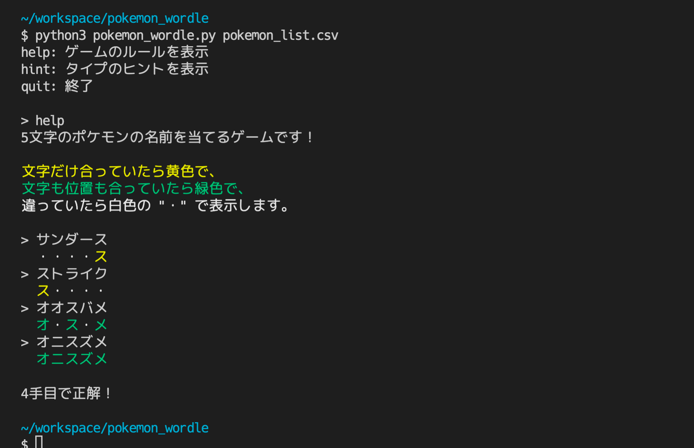

# pokemon_wordle

## Overview
ポケモンWordleが Pythonで遊べるツールです。  
[@giga_yadoran](https://twitter.com/giga_yadoran)様による Web版は[こちら](https://wordle.mega-yadoran.jp/)。  

## Example


## Usage
```
poetry run start [-h] [--debug] [--vs] input_filepath
```

### Help
```
> poetry run start --help
usage: start [-h] [--debug] [--vs] input_filepath

5文字のポケモンの名前を当てるゲームです！

positional arguments:
  input_filepath  インポートするポケモンリストのファイルパス

optional arguments:
  -h, --help      show this help message and exit
  --debug         デバッグモードで実行する
  --vs            コンピュータとの対戦モードで実行する
```

## Other
このツールは個人が開発したものであり、株式会社ポケモン様をはじめとした公式団体とは一切関係ありません。
